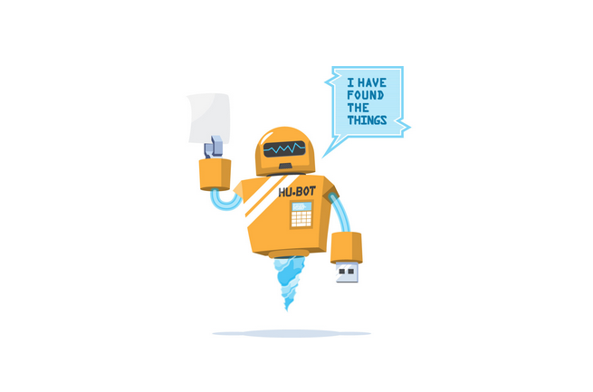

# Hubot Homepage

[](http://badge.fury.io/js/hubot-homepage) [](https://travis-ci.org/stephenyeargin/hubot-homepage)



Give your bot a default home page.

## Installation

In hubot project repo, run:

`npm install hubot-homepage --save`

Then add **hubot-homepage** to your `external-scripts.json`:

```json
[
  "hubot-homepage"
]
```

## Sample Interaction

Visit `http://127.0.0.1:8080/` to see the home page.

## NPM Module

https://www.npmjs.com/package/hubot-homepage
